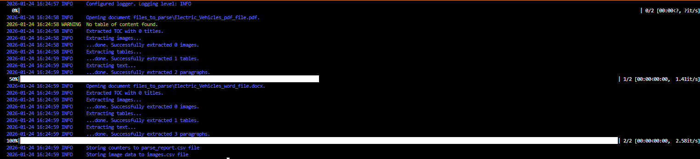
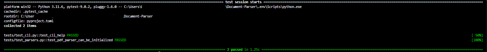

# Document_Parser
## Overview
Document Parser is a Python-based utility designed to extract structured content from PDF and Word documents in a consistent, automated way.
The project supports parsing multiple document types, centralizes configuration, and provides logging to aid troubleshooting and operational visibility.
The extracted data are parsed and saved in separate folders `images`, `tables`, `table of contents` and `texts` in a parent directory `parsed_files` and
a csv file generated with reports of extracted data from each document.

It is well-suited for:
- Batch document processing
- Data extraction pipelines
- Preprocessing documents for analytics or ingestion into downstream systems


## Local Setup
1. Clone and setup repository.
```
git clone https://github.com/Merci93/Document_Parser

cd Document_Parser

python -m venv env

env/Scripts/activate

pip install -r requirements.txt
```

2. Update ``configuration.py`` as needed by either changing the input and output file paths, or leade as is and create the directories and add files in ```files_to_parse```
3. Execute by either running: ```python -m scripts.parse_all``` or use the command line and pass the source path and final directories as inputs.

Using command line:
```
python cli.py parse --input <folder_with_files_to_parse> --output <output_directory>
```

## Parsing log



## test logs



# TODO - fix image extraction